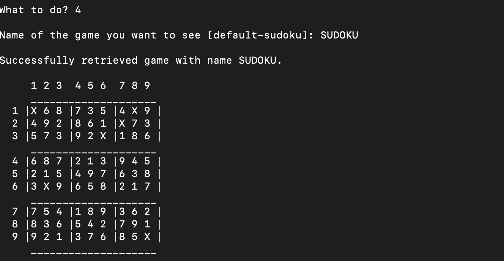

# A P2P-based Sudoku game
<h5>
    Tiziano Citro <br>
    t.citro5@studenti.unisa.it <br>
    Repository GitHub: https://github.com/TizianoCitro/sudoku-p2p
</h5>

## Application
A P2P-based Sudoku challenge game. Each user can place a number of the sudoku game and if the number is not already placed the user takes 1 point. If it is already placed and it is right, the user takes
0 point, but in any other scenario the user loses -1 point. Users join games based on a 9 x 9 matrix, where all users that join a game are automatically notified whenever a user increment their score by placing a correct number and when the game is completed.

## Functionalities
The application provides the functionalities described by the `SudokuGame` interface to each peer that connects to the network.
```java
public interface SudokuGame {
    
	Integer[][] generateNewSudoku(String _game_name);
    
	boolean join(String _game_name, String _nickname);

	List<String> joined();
    
	Integer[][] getSudoku(String _game_name);
    
	Integer placeNumber(String _game_name, int _i, int _j, int _number);
    
	boolean leave(String _game_name);
    
	boolean leaveNetwork();
}
```
Let's see each of them more in detail.

### Menu
When starting the application, to the user will be prompt the menu from which the user can choose what to do.


### GenerateNewSudoku
It allows users to create a new Sudoku game by providing a name for it, in a way that the name has to be unique.
If it is not, then users won't be able to create the game.

From the menu, we can digit `1` and then enter the name they want for their game - `SUDOKU` in our case, thus they can create a new Sudoku game as following:


As you can see, the grid has some `X`, there is where you want to put your number, On how to do that, we will get there in a little while.
We have yet to join the game we have just created.

### Join
It allows users to join an already existing game by preventing them from joining a game that does not exist or a game that they have not joined already.

Let's try by joining the game we created just before. To do so, we can digit `2` and then enter the name of the game we want to join. 
That's not all, at this point we have to enter the nickname we want to join the game with.


### Joined
It provides to the users the possibility to see games that have already been joined. If users have not joined a game yet, nothing will be retrieved.

We can see the game we have joined by simply digit `3`.


### getSudoku
It can show the grid of the Sudoku game to the user, so the user can choose the number to place while visualizing the grid.

Let's now see the grid of the game we have joined. To do so, we have to digit `4` and then enter the name of the game we have joined (`SUDOKU` in our case). 



### PlaceNumber
It allows users to place a number on the grid of a Sudoku game that they have joined already. Otherwise, users will not be able to place numbers.
When placing a number, if the number is not already placed the user takes 1 point. If it is already placed and it is right, the user takes 0 point, but in any other scenario the user loses -1 point.

Now it's the time to place a number in our Sudoku game and earn some points.
Digit `5` and the enter the name of the game you want to place your number on.
Using the above grid we're going to place the number `4` at row `6` and column `2`.


As you can see, we have just earned one point by placing the correct number.

### Leave
It makes it possible for users to leave a game they have joined already.

Time is come to leave the game we have played on so far. So, let's digit `6` and choose the game we want to leave from the list of games that will be prompt to us.


### LeaveNetwork
It makes it possible for users to leave the whole network and by doing so leaving all the games they had joined.

Now that we have left the game, let's also leave the network. To do so digit `7`and enter `Y` to confirm.


## Solution
The application has been developed in `Java` by using `Maven` to manage and resolve application dependencies.
More in detail, the application uses several dependencies and most important are:
- `TomP2P`: used to create and manage a Distributed HashTable (DHT) for enabling a peer-to-peer network, which each peer can join and then gain access to the resources stored in the DHT
- `Junit`: used to achieve unit testing of the developed functionalities
- `TextIO`: used to manage the terminal for user interaction
- `Lombok`: used to minimize the boilerplate while creating classes

Dependencies are specified in the file pom.xml (Project Object Model). Some of them are shown in the following example:

```xml
<dependency>
    <groupId>net.tomp2p</groupId>
    <artifactId>tomp2p-all</artifactId>
    <version>5.0-Beta8</version>
</dependency>

<dependency>
<groupId>org.junit.jupiter</groupId>
<artifactId>junit-jupiter-engine</artifactId>
<version>5.5.2</version>
</dependency>

<dependency>
    <groupId>org.projectlombok</groupId>
    <artifactId>lombok</artifactId>
    <version>LATEST</version>
    <optional>true</optional>
</dependency>
```
The project is organized in two main folder: `src` and `test` as shown below:


Let's go deep and provide a brief description on each package and class by diving more and more on the most important classes and functionalities.
In any case, each class and method are documented through the Javadoc, so if you need more explanation, feel free to go and read the documentation.

## SRC
Let's start with the src folder which contains the code of the whole application.

### Game
The class Game provides the main method that starts the whole application.
It is also responsible for managing user interaction and performing the proper action to the corresponding user input, as well as showing results to the user in the proper way.

### Listener
The listener package provides the interface `MessageListener` and the class `MessageListenerImpl`
that provides the capability to listen for messages sent through the network.


More in detail, the listener receives the messages peers sent on the network when scoring a point by placing the correct number on the grid of the game and when the game is completed. 
When a message is received, the listener just output it on terminal for the user to see.

### Sudoku
In this package there are the most important classes, such as `SudokuGameImpl` or `Sudoku` and so on.


### SudokuGame and SudokuGameImpl
SudokuGame is the interface we presented in a previous paragraph and SudokuGameImpl is the class that implements this interface and provides the actual functionalities.
It is responsible for managing the DHT where we store:
- the sudoku game grid as a matrix of the number on it
- the players that join a certain game, for allowing us to notify them by sending direct messages every time a player scores a point or when a game is completed
- the nicknames used by the players when they join a certain game
- the scores of each player, thus we can keep track of them for showing the results when a game is completed

Let's see how we can interact with the DHT. In the following snippet we will show the `putSudoku` method that stores the grid of a Sudoku game in the DHT given a name for the game and the grid as a matrix of numbers.
Then we will show the `retrieveSudoku` method that retrieves a grid from the DHT given the name of a game. 

```java
public class SudokuGameImpl implements Sudoku {
    
    @Override
    private boolean putSudoku(String _game_name, Integer[][] cellsNumbers) {
        FutureGet futureGet = dht.get(Number160.createHash(_game_name)).start();
        futureGet.awaitUninterruptibly();
        if (futureGet.isSuccess()) {
            dht.put(Number160.createHash(_game_name))
                    .data(new Data(cellsNumbers))
                    .start()
                    .awaitUninterruptibly();
            return true;
        }
        return false;
    }

    @Override
    private Integer[][] retrieveSudoku(String _game_name) {
        FutureGet futureGet = dht.get(Number160.createHash(_game_name)).start();
        futureGet.awaitUninterruptibly();
        if (futureGet.isSuccess()) {
            if (!futureGet.isEmpty()) {
                return (Integer[][]) futureGet.dataMap()
                        .values()
                        .iterator()
                        .next()
                        .object();
            }
        }
        return null;
    }
}
```

### Model
The model package is crucial because it provides the classes that model the objects of the application domain.


The `Cell` class models a single cell in a grid, that is modelled by the `Grid` class. While, a whole game is modelled by the `Sudoku` class.

### Printer
The printer package provides the `SudokuPrettyPrinter` class used to print the grid of the game for the use to interact with it.


Example of a printed grid:


### Utils
Classes and enumerations in this package provides utility functionalities required to other classes to manage the effort.
For example, `Scores` enumeration provides the point a user gain or loses after attempting to place a number.

### Verifier
Both `SudokuVerifier` and `GridVerifier` provides method to verify the state of the game before and after user interaction.
As example, they're responsible to check whether the insertion of a number is correct or not.

### Utils
Finally, there's the utils package that provides utility classes and enumerations.
Slightly more in detail, the `GameOptions` enum provides the options from which a user can choose what to do when the application is up and running. 

## Test
Let's address now the test folder which contains the `SudokuGameTest` class where all the unit tests for the application are written.
We are going to go deeper in unit testing in the next paragraph. 


## Unit testing
The unit testing has been performed by using `Junit`.

Tests are implemented in the "SudokuGameTest" class, in which each method of the `SudokuGame` interface (corresponding to the functionality of the application) is tested. 
Each method used for testing purposes is annotated with `@Test`, a JUnit annotation that specifies that the method is running a test case.
The order for test execution is described by the `@Order` annotation and for doing so, it is required to annotate the class as following:

```java
@TestMethodOrder(OrderAnnotation.class)
public class SudokuGameTest {

    @Test
    @Order(1)
    public void firstTest() {
    }

    @Test
    @Order(2)
    public void secondTest() {
        
    }
}
```

In this way the test case in firstTest method will be executed before the test case in secondTest method.

Crucial is the method `setup` that runs before all test (as the `@BeforeAll` annotation suggests) and allows us to create the peers we're going to use for our test:
While the `leaveNetwork` method cleans everything after all test are executed (`@AfterAll` annotation), the `leaveAllGames` method is executed after each test (`@AfteEach` annotation), so all peers we'll leave the games they have joined in the previous test. 
```java
public class SudokuGameTest {
    
    @BeforeAll
    public static void setup() {
        peer1 = new SudokuGameImpl(0, MASTER_IP, new MessageListenerImpl(0));
        peer2 = new SudokuGameImpl(1, MASTER_IP, new MessageListenerImpl(1));
        peer3 = new SudokuGameImpl(2, MASTER_IP, new MessageListenerImpl(2));
        peer4 = new SudokuGameImpl(3, MASTER_IP, new MessageListenerImpl(3));
    }

    @AfterAll
    public static void leaveNetwork() {
        peer1.leaveNetwork();
        peer2.leaveNetwork();
        peer3.leaveNetwork();
        peer4.leaveNetwork();
    }

    @AfterEach
    public void leaveAllGames() {
        leaveGames(peer1);
        leaveGames(peer2);
        leaveGames(peer3);
        leaveGames(peer4);
    }
}
```

Now that we have seen the overall configuration, let's go deep and see what each of the test actually does.

### GenerateNewSudokuAndJoin
Tests the creation of a new Sudoku game by a peer and the subsequent joining of other peers.

### GenerateAlreadyExistingSudoku
Checks that a peer cannot create a new game which will be a duplicate of an already existing game, considering that each game is identified by the name.

### JoinNotExistingGame
Tests that it will not be possible for a user to join a game that does not exist.

### JoinAlreadyJoinedGame
Tests that it will not be possible for a user to join a game that he or she has joined already.

### JoinedGames
Checks the possibility for a user to retrieve the games that he or she has joined, in case at least one game has been joined.

